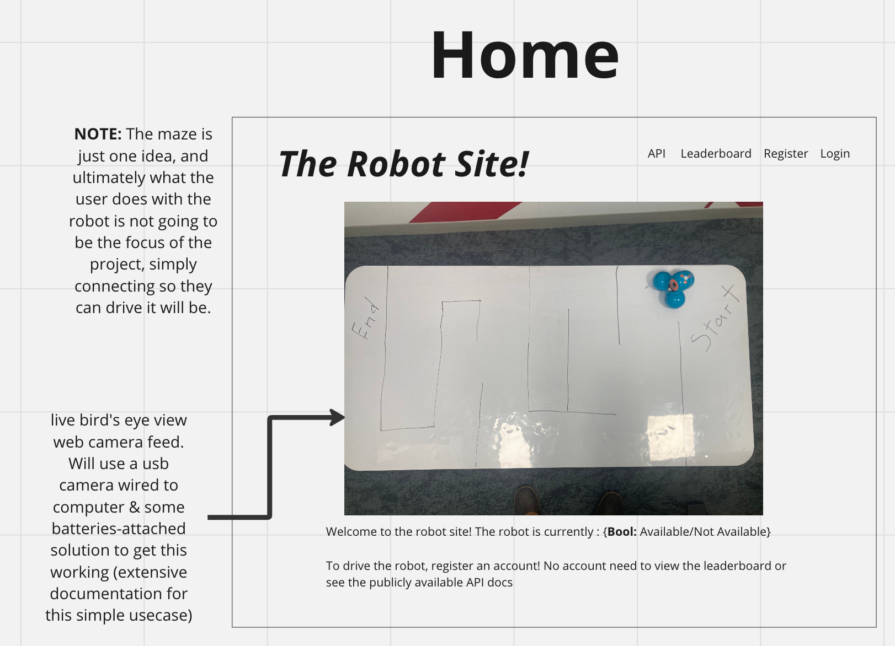
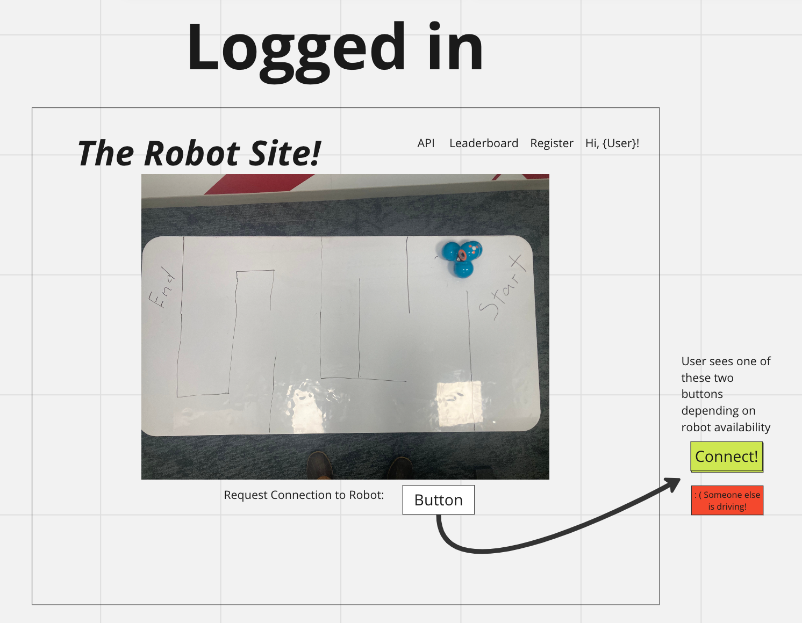
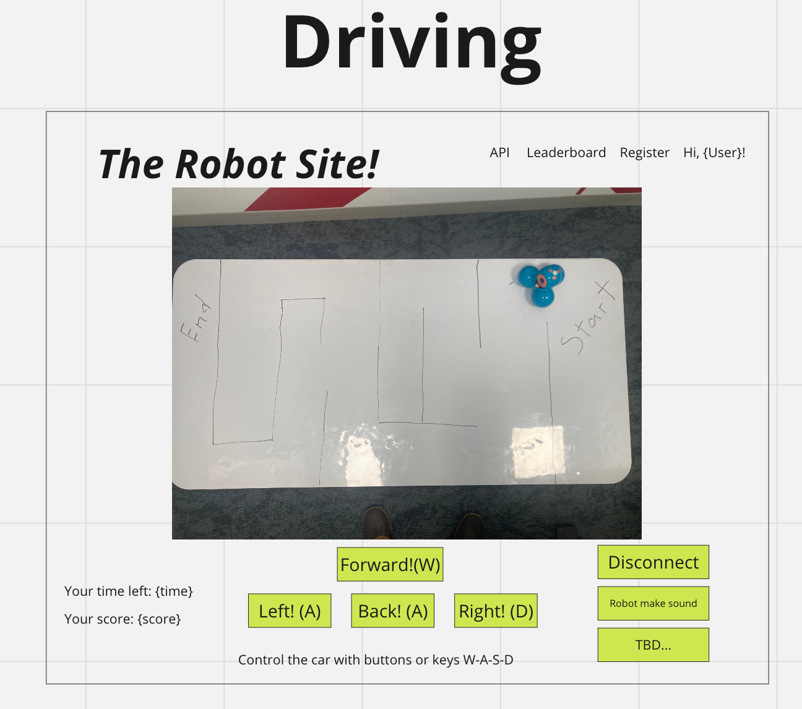
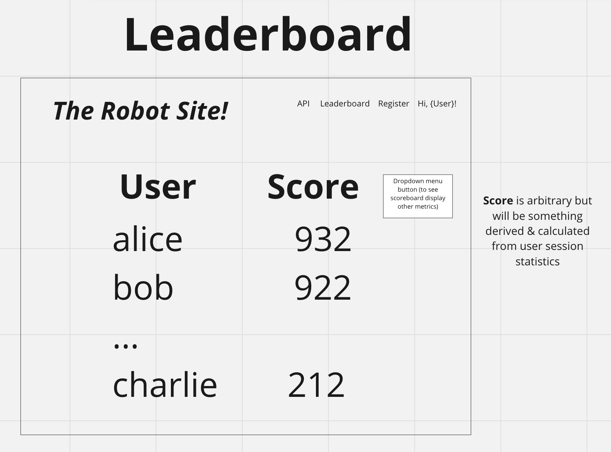
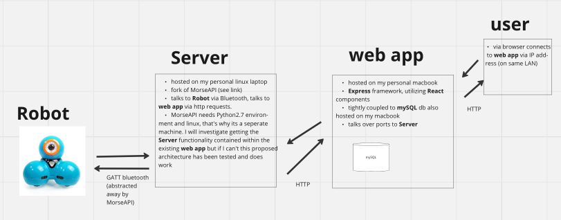

## Team
Jake Simonds

## Proposal addendum
What I want this project to be when it is completed is a teaching tool geared towards high school or even non-technical professionals that answers the question 'How do a lot of modern websites work?' in a fun way. 

The project when complete could be pulled down from github and booted up locally, and then over a wifi networks students or workshop participants could create accounts, drive the robot, and then use the Developer's Portal to query the robot's state through a tool like postman or even their browsers directly. 

### Why I would like to work as an individual: 
- I work full time + other commitments so would be tricky to meet with a group
- I'd like to keep iterating on this project after term ends (taking computer vision this summer), and so being intimately familiar with all aspects of it would help
## Project goal: Robot Race / Game

A React w/ Express App that lets a user log in and then drive a Wonder Dash robot through a web interface like navigating a (real world) maze or pushing a ball into a goal. User data from driving sessions is tracked in a MySQL relational database and the app displays a dynamic 'leaderboard' (like an arcade machine). The app will communicate with a basic server on the same local network which exposes an python API (which I found online) that controls the robot.   
## User stories

  As a user, I **can**: 
  - request connect & disconnect to robot
  - connect to the robot when available and drive it around
  - see the robot via a live webcam that gives a bird's eye view (to keep things simple camera will not be on the robot itself) whether or not I am connected to the robot
  - see my own 'stats' after a session with the robot
  - see a leaderboard of other user stats & opt in/out of that

I **cannot**: 
- access the site except over a local network connection
- drive the robot when the robot is not turned on and functional
- drive the robot forever. Connection will time out at some point 

## UI design
See figures at end of document. 
## Architecture and technical requirements
See figures at end of document. 
* **Are you proposing a full-stack application? If not, why not and what will you do instead?**
Yes. I use express, React, SQL and Swagger yaml API docs at work so I'm choosing things I'm reasonably comfortable with & confident I can get working relatively quickly. 

* **How will your app use data, including information about and/or provided by your users?**
My app will use mySQL to keep track of basic user info, and then when a user has a session with the robot I will naively track (I'm imagining just counting instances of commands sent to robot) what they do (probably in a JSON or other document), and then write some pseudo-algorithm to generate a 'score', and put that & anything else worth saving in mySQL. 

* **Will your app have authentication? If not, then how will you address security?**
I am going to have basic authentication. Without authentication I am going to expose read-only robot information already exposed by a script in MorseAPI, and the live video feed. 

* **Will your app have a REST API? If not, why not and what will you do instead?**

I want to build a 'Developers Portal' for my website, modelled after real world developers portals, that would allow students to use a tool like postman or their browser to query the robot's state. It would be a very basic set of read-only RESTful api endpoints (probably all GET requests) that allow a user via postman or direct URL querying to inquire into the current state of the robot (basically repackaging morseapi/examples/sensor_readout.py into API form). This I'll put together and then define with a yaml file so then Swagger can auto-generate docs. 

* **Will your app consume data from a web-accessible API? If not, why not and what will you do instead?**
Not directly. In place of this I'm forking MorseAPI and then generating my own API to expose information in a web-accessible way. 
### Proof of concept for beyond-scope-of-5610 components

#### Wonder Dash Robot documentation
I will fork this unofficial repo, which I've been playing with a good bit and seems pretty well built:
https://github.com/IlyaSukhanov/morseapi
There is also: 
https://observablehq.com/@tomlarkworthy/wonder (haven't gotten this one to connect, is based off of MorseAPI)
https://github.com/playi/WonderPy
Seems less feature full than MorseAPI, but useful as second source, was able to connect. 

#### Progress so far
I have been able to prototype with two flask apps, one a web app (adapted from HW3), the second connected to the robot & listening for commands from the web app over http requests. I can then open a browser, go to the IP address of my hosting machine, and control the robot in a rudimentary way. 
Video: https://www.youtube.com/watch?v=Y2RbJfnlC3k

Flask blog with MorseAPI-fork calls bolted on: https://github.com/jakesimonds/WebAppPrototype

My fork of MorseAPI (right now just added app.py, a basic flask app): https://github.com/jakesimonds/morseapiJakeFork

UI sketches 
- 
- 
- 
- 

Architecture Diagram 
- 

